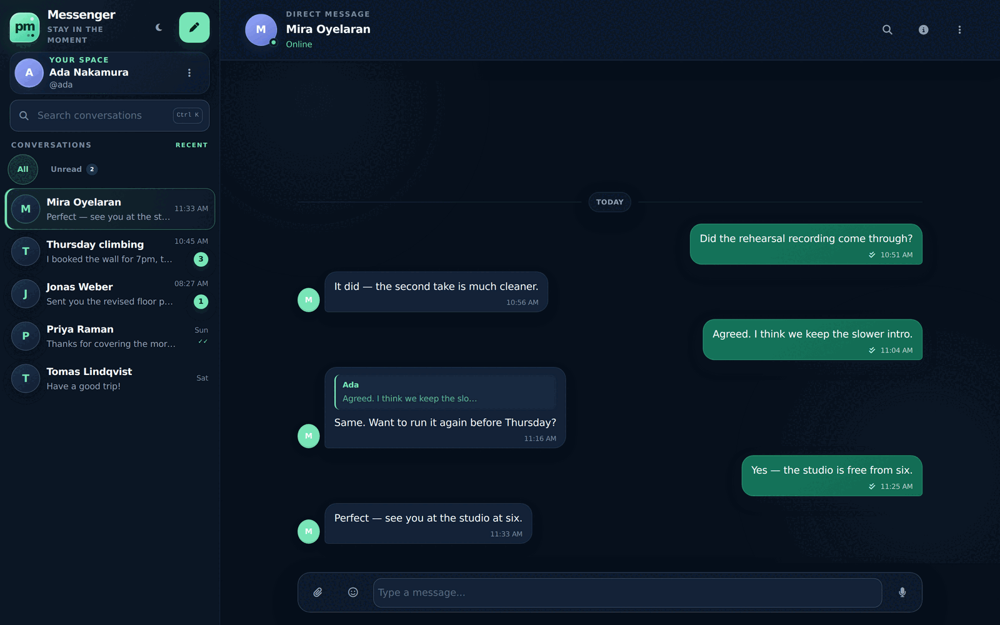
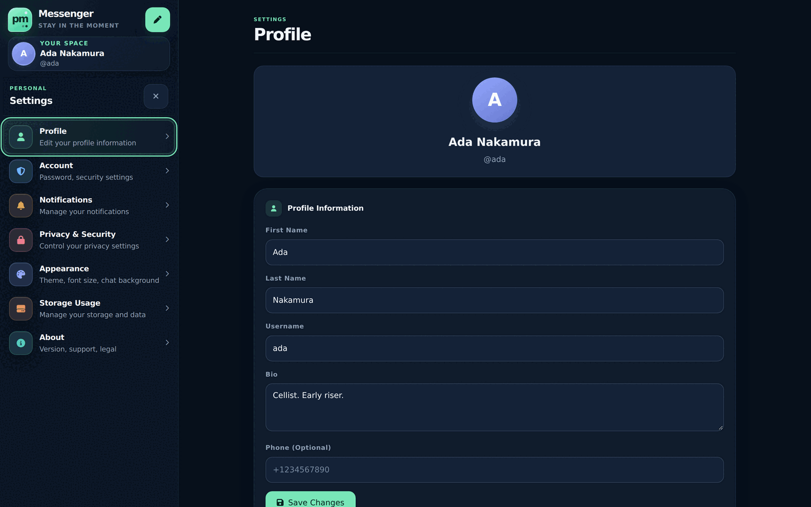
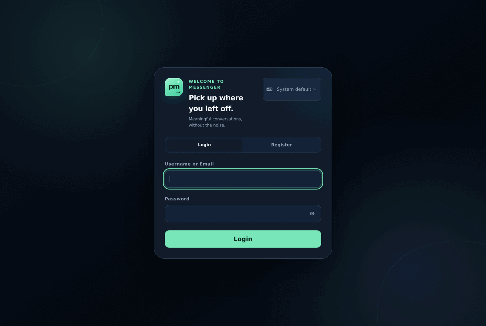
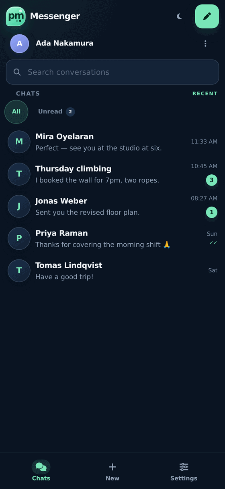

# php-private-messenger

[English](README.md) · **简体中文**

用原生 PHP 8 和 MySQL 实现的自托管私密聊天。没有框架，运行时也没有任何构建步骤——克隆
下来，把 Web 服务器指向它，执行 `composer install`，就能跑起来。部署时不编译任何东西，
参与贡献也不需要 JavaScript 工具链。

有一个需要明确说明的例外：`crypto/` 目录下那个**可选且尚未完成**的加密层，是用 Rust 编译成
WebAssembly 的。它的产物已经连同校验和一起提交进仓库，因此运行和部署仍然不需要任何工具链；
只有在你要修改加密层本身时才需要 Rust。详见 [crypto/BUILDING.md](crypto/BUILDING.md)。

这是一个刻意保持"无趣"的小型代码库，但安全约束异常严格：加固过的会话模型、使用加密存储
TOTP 密钥的两步验证、只能通过鉴权端点访问的私有媒体文件、失败即拒绝（fail closed）的上传
病毒扫描，以及禁止内联事件处理器和 `eval` 的内容安全策略（CSP）。上述每一项都有对应的回归
测试。

> **本项目不提供端到端加密。** TLS 只保护传输过程，服务器仍然可以读取已存储的消息和附件。
> 若要了解实现端到端加密所需的设计，请阅读
> [docs/security/e2ee-readiness.md](docs/security/e2ee-readiness.md)；请勿把基于本代码的
> 部署描述为"端到端加密"。
>
> 另有一条**可选、实验性、未经审计**的加密通道（除非设置 `PM_PROTECTED_CHATS_ENABLED=1`
> 否则关闭），基于 OpenMLS。该文档列出的七道关卡已关闭六道：RFC 9420 已知答案向量、跨引擎
> 互操作、模糊测试、安全码、恢复文件、设备移除。第七道是**独立密码学审计**，无法在仓库内部
> 完成。如果你做这类工作，[docs/security/review-scope.md](docs/security/review-scope.md)
> 是审计说明，[docs/security/threat-model.md](docs/security/threat-model.md) 是它的前提
> 假设。在那道关卡关闭之前，这里的任何东西都不会被称为端到端加密。

## 界面截图

以下示例数据均为虚构，不涉及任何真实账号或真实对话。

| 会话 | 设置 |
|---|---|
|  |  |

| 登录 | 移动端 |
|---|---|
|  |  |

## 功能

- 一对一聊天与群聊，支持回复、表情回应、编辑、删除、已读回执、正在输入提示和消息搜索。
- 附件（图片、文档、压缩包），带 MIME、图像和压缩包校验，并可选接入 ClamAV 扫描。
- 账号支持 TOTP 两步验证，备用恢复码经过加盐（pepper）哈希存储。
- 五种界面语言（英语、西班牙语、阿拉伯语、简体中文、繁体中文），并支持从右到左布局。
- 响应式单页界面；移动端布局带底部导航栏。
- **不发起任何第三方请求。** Bootstrap 和 Font Awesome 都已内置在 `assets/vendor/`，
  因此应用不从任何 CDN 加载资源，在完全没有外网的环境中也能运行，也不会把「谁在使用你的实例」这一信息暴露给第三方。内容安全策略（CSP）中不包含任何外部来源——
  `tests/csp_posture_test.php` 会持续保证这一点。

界面中显示的名称是 **Messenger**，这只是一个占位名，定义在 `index.html` 和
`locales/*.json` 词条文件中，可以随意改成你喜欢的名字——只要保证 `index.html` 中的英文
文案与 `locales/en.json` 完全一致，否则 i18n 测试会报错。

## 运行环境

- PHP **8.2** 或 **8.3**，需启用 `fileinfo`、`gd`、`iconv`、`mbstring`、`mysqli`、
  `pcntl`、`sodium`、`zip` 扩展。APCu 可选但推荐（限流和媒体校验缓存依赖它）。
- MySQL 8 或 MariaDB 10.5+。
- Apache（需 `mod_rewrite` 与 `mod_headers`），或把等效规则完整移植到 nginx
  （见[部署文档](docs/deployment.md)）。
- Composer。

## 快速开始

最快的体验方式：

```sh
git clone https://github.com/<你的账号>/php-private-messenger.git
cd php-private-messenger
docker compose up --build        # 然后打开 http://127.0.0.1:8088
```

这会启动 nginx、PHP-FPM 和 MySQL，自动执行 `schema.sql` 与全部迁移，并使用与真实部署
相同的规则对外提供服务，因此你在本地验证到的攻击面与线上一致。它是**开发用**环境：数据库
密码是公开写死的，没有 TLS，并且由于没有接入病毒扫描，上传会被直接拒绝。
详见 [`compose.yaml`](compose.yaml)。

### 手动安装

```sh
git clone https://github.com/<你的账号>/php-private-messenger.git
cd php-private-messenger
composer install --no-dev
cp .env.example .env     # 然后填写其中的值，见"配置"一节
mysql -u root -p -e "CREATE DATABASE messenger CHARACTER SET utf8mb4 COLLATE utf8mb4_general_ci"
mysql -u root -p messenger < schema.sql
for m in migrations/*.sql; do mysql -u root -p messenger < "$m"; done
```

把 Web 服务器的站点根目录指向仓库根目录。随仓库提供的 `.htaccess` **承担着实际的安全职责**，
并非可有可无的配置：它限制了哪些 PHP 文件可以被访问、阻止对 `uploads/` 的直接访问，并设置
安全响应头。请不要删除它；如果使用 nginx，必须把每一条规则都移植过去。

## 配置

所有配置都来自 PHP 进程的环境变量，不从任何提交进仓库的文件中读取；任何一项缺失或非法时，
相关组件都会直接拒绝启动，而不是回退到默认值。复制 `.env.example`，并通过 PHP-FPM 进程池
（`env[...]`）、Apache（`ProxyFCGISetEnvIf`）或 systemd 注入真实值。

| 变量 | 必需 | 用途 |
|---|---|---|
| `PM_DB_HOST`、`PM_DB_NAME`、`PM_DB_USERNAME` | 是 | 数据库连接。 |
| `PM_DB_PASSWORD` | 是 | 数据库密码，**至少 32 个字符**。 |
| `PM_BACKUP_CODE_PEPPER` | 是 | 两步验证备用码的 pepper，至少 32 个字符。修改后所有已发放的备用码立即失效。 |
| `PM_TOTP_ENCRYPTION_KEY` | 是 | 用于加密静态存储的 TOTP 密钥。一旦丢失，所有账号都将无法通过两步验证。 |
| `PM_CLAMD_ENDPOINT` | 否 | ClamAV 守护进程，仅支持 Unix socket（`unix:///run/clamd.sock`）；TCP 端点会被刻意拒绝。未配置时上传一律被拒——见[部署文档](docs/deployment.md)。 |
| `PM_MESSAGE_IDEMPOTENCY_ENABLED` | 否 | 设为精确的 `1` 以启用基于 `client_message_id` 的发送去重。在所有节点完成对应迁移之前请勿设置。 |

`config/database.php` 中还定义了 `SITE_URL`，它必须与你真实的站点来源（origin）一致——
API 会以它为基准拒绝跨站的状态变更请求。

## 数据库

`schema.sql` 会创建应用使用的七张表——`users`、`chats`、`chat_participants`、
`messages`、`message_status`、`typing_indicators` 和 `backup_codes`——并按照外键依赖顺序
排列。请在空数据库上执行它，然后按文件名顺序执行 `migrations/` 下的全部文件。

这些迁移脚本是**幂等的**：每个脚本都会先查询 `information_schema`，只有在字段缺失时才会
生成并执行 DDL。因此在全新数据库上执行是安全的，重复执行也无害。其中两个迁移还带有 PHP
部分（`*_encrypt_totp_secrets.php`、`*_hash_legacy_backup_codes.php`），用于改写已有数据行；
全新安装时没有数据需要改写，但仍建议执行一遍以保持状态一致；在已有数据的实例上执行前请先备份。

`tests/schema_test.php` 会检查 `schema.sql` 覆盖了代码查询的每一张表，并且不包含任何数据。

## 架构

```
index.html          单页界面；所有 HTML 标记都在这里
api/*.php           六个 POST-JSON 端点，只做轻量的动作分发
classes/*.php       真正的业务逻辑（Chat、Auth、TwoFactor、Safe*、I18n 等）
assets/js/*.js      六个脚本，按固定顺序加载，不使用模块化
locales/*.json      每种语言一个词条文件
tests/*.php|js      纯脚本；不用 PHPUnit，也不用 Jest
```

**请求路径。** 整个应用就是 `index.html` 加上六个端点：`attachment`、`auth`、`avatar`、
`chat`、`profile`、`settings`。其他任何 `.php` 文件在设计上都无法通过 HTTP 访问——白名单
写在 `.htaccess` 中，并由 `tests/repository_exposure_test.php` 固定校验。新增端点必须同时
修改那条规则。

**端点很薄。** 它们负责校验输入、强制同源，并在**打开数据库连接之前**完成限流，然后把工作
交给对应的类。请保持这个顺序；`tests/protected_api_pre_db_rate_limit_test.php` 会强制它。

**私有媒体。** 已存储的文件永远不能通过 `/uploads` 直接访问。头像和附件只能由
`api/avatar.php` 与 `api/attachment.php` 在通过会话、授权、路径、MIME 和文件一致性检查后
下发，并受按账号和按来源的流量配额限制。

**前端。** 六个脚本按固定顺序加载。`security-hardening.js` 会用安全的 DOM 构建函数覆盖旧版
脚本中的渲染路径，并且只有在它自身执行到最后一行时才会放行应用启动——因此一旦该文件解析
失败，界面会保持静止，而不会退回到不安全的渲染方式。请不要重新引入基于 `innerHTML` 的渲染，
也不要在那道"闸门"之后追加代码。六个脚本共用同一个缓存失效查询参数，修改时必须同时更新
所有出现位置。

**本地化。** `I18n::encodeResponse()` 只翻译 JSON 响应最外层的 `message`/`error` 字段；
聊天和个人资料数据保持与语言无关。`index.html` 中每一条可见的英文文案都必须在
`locales/en.json` 中逐字存在，并且五个词条文件的键名与占位符必须完全一致——
`tests/i18n_catalog_test.php` 会逐项检查。

## 测试

不使用 PHPUnit，也不使用 Jest；测试就是普通脚本，输出 `PASS:` 行，失败时以非零状态退出。

```sh
for t in tests/*_test.php; do php "$t"; done            # 25 个 PHP 测试套件
for t in tests/*_runtime_test.js; do node "$t"; done     # 6 个前端测试套件
php tests/i18n_catalog_test.php                          # 单独运行某一个
```

加密层还有一个测试套件，需要 Rust 工具链；运行本应用或参与贡献都不需要它。它跑的是 MLS
工作组自己发布的 RFC 9420 已知答案测试向量：

```sh
cd crypto && cargo test --test rfc9420_vectors -- --nocapture
```

这些向量按摘要固定。`tests/crypto_artifact_test.php` 在不需要任何工具链的情况下校验这些
摘要，所以若有人改动向量去迁就一个本该失败的构建，普通测试套件就会先失败。

协议层的那些向量在 OpenMLS 里位于 `#[cfg(test)]` 之后，依赖方无法调用，因此改由它自己的
测试框架来跑；脚本会把 crates.io 上的 crate 压缩包与 `crypto/Cargo.lock` 里的校验和逐字节
核对：

```sh
crypto/vectors/upstream-kats.sh
```

共 16 个套件，包含 passive-client 向量。它能证明什么、不能证明什么，写在
`docs/security/rfc9420-vectors.md` 里。

还有一组跨浏览器互操作测试，需要 Playwright 的浏览器：

```sh
node crypto/interop/run.mjs
```

它在每个 JS 引擎里各放一台设备，并对所有有序组合真正跑一遍会话。结果、版本与局限记录在
`docs/security/browser-interop.md`；`crypto/interop/harness.html` 也可以直接在任意
浏览器（包括手机）里打开自行查看。

按工作流同样的方式做静态检查：

```sh
git ls-files -z '*.php' ':!:vendor/**' | xargs -0 -n1 php -l
git ls-files -z '*.js' | xargs -0 -n1 node --check
composer audit --locked
```

它们都是纯单元测试：不依赖数据库、不依赖网络、不需要准备夹具数据。其中不少测试直接对源码
文本做断言，因此同时起到了防止误删安全控制的作用。

## 参与贡献

请阅读 [CONTRIBUTING.md](CONTRIBUTING.md)。简而言之：提交 PR 前先跑一遍测试；不要重新格式化
未改动的代码行（仓库存在历史遗留的空白字符问题）；如果改动削弱了某项安全控制，请准备好用
测试说明为什么这样做仍然是安全的。

## 安全问题

请通过私密渠道报告漏洞——见 [SECURITY.md](SECURITY.md)。

## 许可证

[MIT](LICENSE)。
